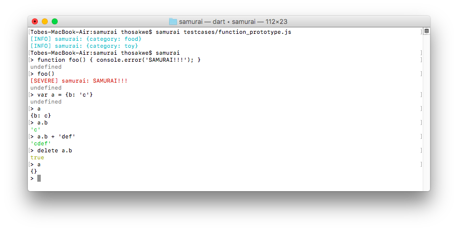

# samurai
[](https://pub.dartlang.org/packages/samurai)
[](https://travis-ci.org/samurai-dart/samurai)

Portable JS engine, written in Dart.




## Possibilities
* Existing JS libraries that cannot be easily ported can be wrapped
(I'm looking at you, Hammer, and esprima!)
* Server-side rendering of compiled JS apps
  * Will require a headless DOM for Samurai
* **Embedding of sandboxed, safe scripts in Dart applications**

## Strong Mode
As of this writing, this package is incompatible with strong mode,
due to a transitive dependency on `package:lists`, which is not only old, but has its
issue tracker disabled (nice!).

The source of this dependency is unknown, as the dependencies of `samurai` seem to
all be Dart 2-compatible libraries that are frequently used with current versions of Dart,
and have either few dependencies or no dependency themselves.

## Usage
### Command-Line
The `samurai` executable has similar syntax to Node.js; it can be passed a single argument
to execute a file, or none to start a REPL, complete with colorful printing.

### Programmatically
In most cases, create a `Samurai` instance, and inject a `console`
object into its global scope (enabling `console.log`, etc.):

```dart
import 'package:logging/logging.dart';
import 'package:parsejs/parsejs.dart';
import 'package:samurai/samurai.dart';

void main() {
  var samurai = new Samurai();
  var logger = new Logger('samurai');
  samurai.global.properties['console'] = new JsConsole(logger);
}
```

Next, parse an AST of the source text you wish to execute, and pass it to the interpreter:

```dart
void main() {
  // ...
  var program = parsejs('<source text>', filename: 'foo.js');
  samurai.visitProgram(program);
}
```

Once the program has been run (synchronously!), you might then wish to query its
global scope, which is an instance of
[`SymbolTable`](https://pub.dartlang.org/packages/symbol_table):

```dart
void main() {
  // ...
  var exports = samurai.globalScope.resolve('exports').value;
  print('Exports: ${exports.properties}');
}
```

## Interaction with Dart
If you just wanted a JavaScript interpreter, you'd probably want to use Node.js.
`samurai`'s entire API is public; therefore, you can freely exchange data between
the two languages.

```dart
void main() {
  // ...
  var module = samurai.global.properties['module'] = new JsObject();
  var exports = module.properties['exports'] = new JsObject();
  exports['thirtyTwo'] = new JsNumber(32);
  exports['someFunction'] = new JsFunction(samurai.global, (samurai, arguments, ctx) {
    return new JsString('Hello from Dart!!!');
  });
}
```

# Acknowledgements and Contributions
* A *huge* thanks to Asger Feldthaus and his [parsejs](https://github.com/asgerf/parsejs.dart) library.
